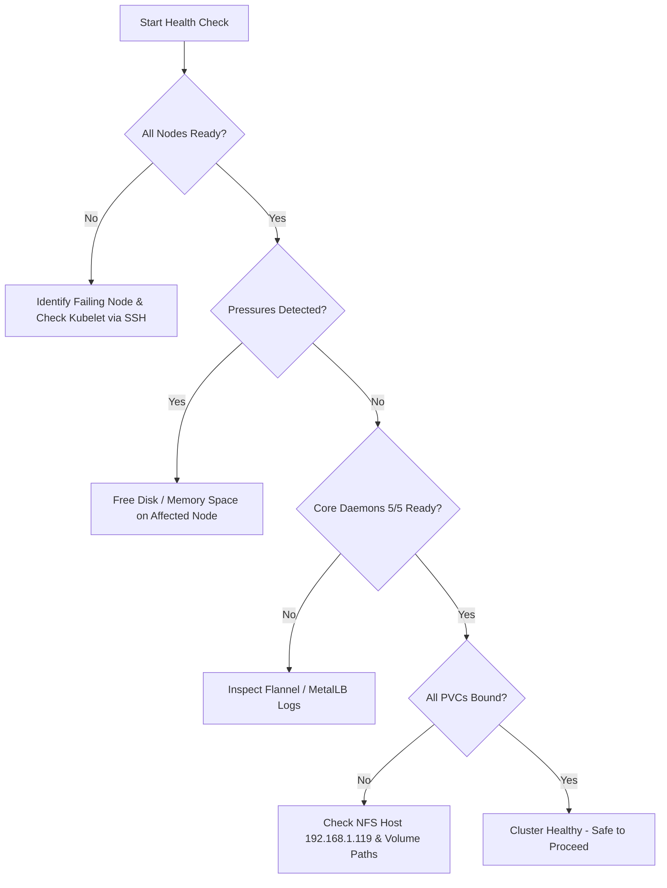

# Cluster Health Check & Diagnostic Procedures

This guide provides a standardized checklist and commands for autonomous agents to verify cluster health before and after performing upgrades, maintenance, or infrastructure changes.

---

## 1. Fast Health Audit (One-Liner Checklist)

Run this consolidated audit from PowerShell to check the entire cluster state at a glance:

```powershell
Write-Host "=== NODE STATUS ===" -ForegroundColor Cyan
kubectl get nodes -o wide

Write-Host "`n=== SYSTEM PODS STATUS ===" -ForegroundColor Cyan
kubectl get pods -n kube-system -o wide

Write-Host "`n=== CNI (FLANNEL) & LOAD BALANCER (METALLB) ===" -ForegroundColor Cyan
kubectl get pods -n kube-flannel
kubectl get pods -n metallb-system

Write-Host "`n=== STORAGE HEALTH (UNBOUND VOLUMES) ===" -ForegroundColor Cyan
kubectl get pvc -A | grep -v -E "Bound|STATUS"

Write-Host "`n=== INGRESS CONTROLLER ===" -ForegroundColor Cyan
kubectl get svc -n traefik
```

---

## 2. In-Depth Component Verifications

### 2.1 Node Conditions & Hardware Pressure
Verify that no node is experiencing disk, memory, or PID pressure:

```powershell
kubectl get nodes -o custom-columns=NAME:.metadata.name,READY:.status.conditions[?(@.type==\"Ready\")].status,MEM_PRESS:.status.conditions[?(@.type==\"MemoryPressure\")].status,DISK_PRESS:.status.conditions[?(@.type==\"DiskPressure\")].status,PID_PRESS:.status.conditions[?(@.type==\"PIDPressure\")].status
```
**Expected Output**:
* `READY`: `True` for all nodes.
* `MEM_PRESS`: `False` for all nodes.
* `DISK_PRESS`: `False` for all nodes.
* `PID_PRESS`: `False` for all nodes.

### 2.2 Control Plane Diagnostics (`pi4-red`)
Check etcd and API server health:
```powershell
# Verify kube-system pods have low restart counts
kubectl get pods -n kube-system -o wide

# Check etcd health
kubectl logs -n kube-system etcd-pi4-red --tail=20
```

### 2.3 CNI & Pod Interconnectivity (Flannel)
Verify Flannel daemonset status on all 5 nodes:
```powershell
kubectl get daemonset -n kube-flannel kube-flannel-ds
```
* `DESIRED`, `CURRENT`, and `READY` counts must match `5`.

### 2.4 Load Balancer (MetalLB)
Check MetalLB speaker instances and ARP announcements:
```powershell
kubectl get daemonset -n metallb-system speaker
kubectl get pods -n metallb-system -l app=metallb
```
* Ensure speaker pods are running across all nodes.

### 2.5 Persistent Storage (Debian NFS Host)
Verify PersistentVolumes and claims:
```powershell
# List all PVs and verify none are in 'Failed' or 'Released' state unexpectedly
kubectl get pv

# Check PVC bindings
kubectl get pvc -A
```
If a volume fails to mount:
1. Verify NFS host `192.168.1.119` (`cinema`) is reachable.
2. Ensure `/mnt/nas/disk/k8s/` is mounted and exported on Debian host.

### 2.6 Ingress Controller & External Connectivity
Test that Traefik is responding on the MetalLB LoadBalancer VIP:
```powershell
curl -k -I http://192.168.1.230
```
Expected response: HTTP status code (e.g., `404 Not Found` for default backend or `200 OK` / `301 Moved Permanently` for valid routes).

---

## 3. Automated Agent Decision Tree

When evaluating cluster health:

