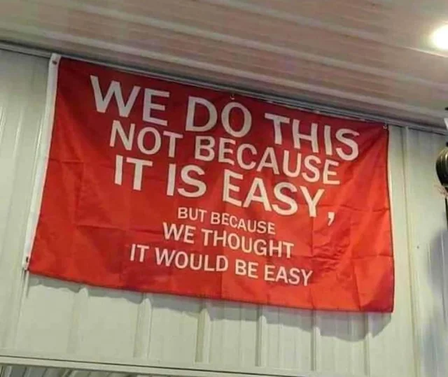

Hi! This is my Portfolio. You can access it from https://www.anil-sezer.com/
---
Made by using Domain Driven Design

### Full Tech Stack:
.NET 7 & Razor

1. PostgreSQL
2. Kubernetes
3. Docker
4. Bootstrap
5. Prometheus
6. Grafana
7. Lens
8. SQLite (Now PostgreSQL)

#### .NET Libraries:
Serilog

### Coming Next:
1. Elastic Search
2. Kafka
3. OpenTelemetry
4. 3 IoT's

Used this template for front end: https://bootstrapmade.com/demo/iPortfolio/
